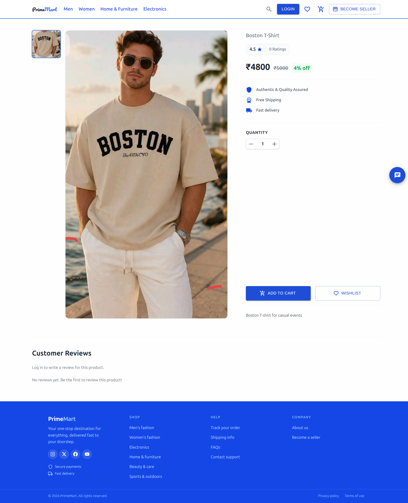
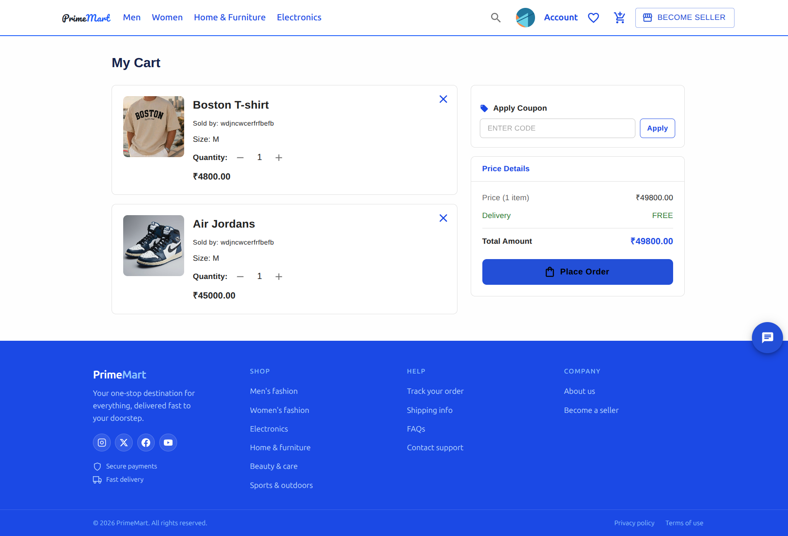
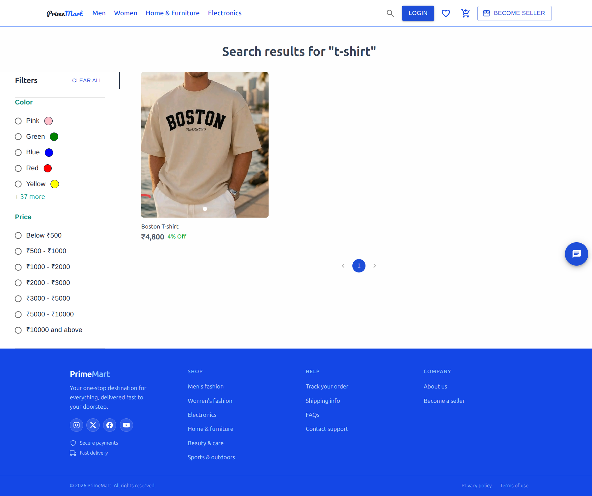
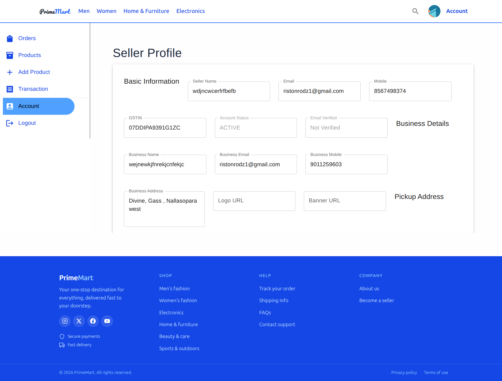
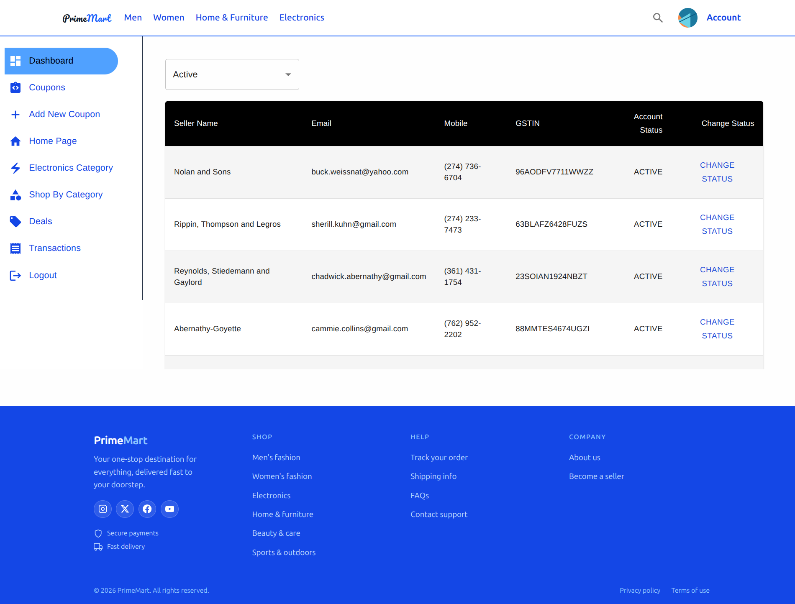
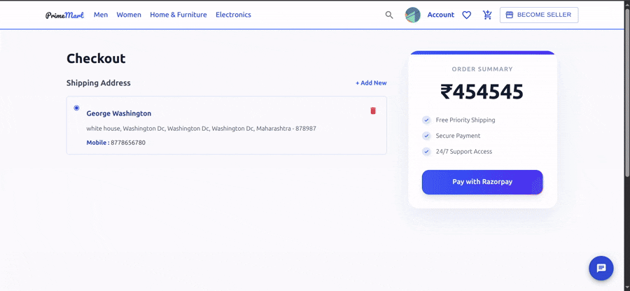
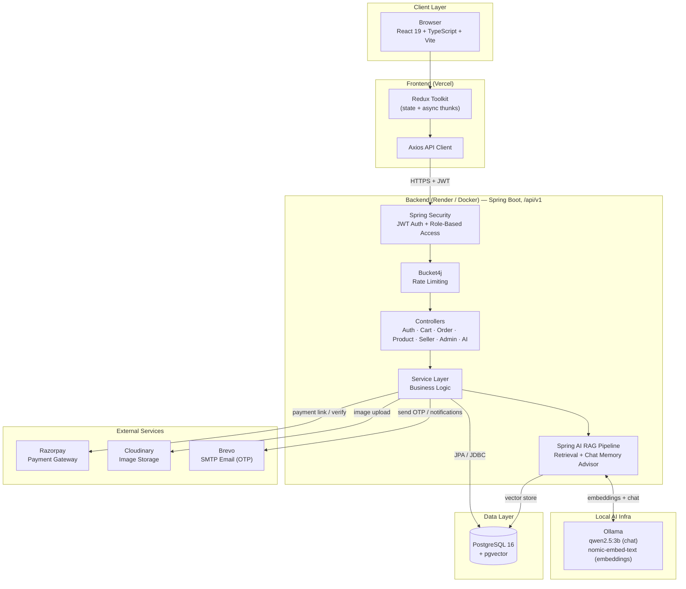

# PrimeMart

A multi-tenant e-commerce platform with full customer, seller, and admin workflows — built to demonstrate real-world backend architecture, modern frontend engineering, and applied AI. Built as a portfolio project targeting fintech/banking engineering roles. <br>
**Backend API:** [backend](https://ecommerce-eh88.onrender.com) <br>
**Live Demo:** [Live Demo](https://ecommerce-five-blush-38.vercel.app/) <br>

---

## Screenshots

| Home | Product Details | Cart |
|---|---|---|
|  |  |  |

| Search | Seller Dashboard | Admin Dashboard |
|---|---|---|
|  |  |  |

---

## AI Shopping Assistant Demo


*RAG-powered chat widget answering product questions in real time — fully local via Ollama + pgvector, no external AI API calls.*

---

## Razorpay Payment Demo



*End-to-end checkout flow — cart → Razorpay payment gateway → order confirmation — with server-side payment verification and order/payment status tracking.* (The max payable amount is caped to 50000 in Test mode)

---

## Overview

PrimeMart covers the full e-commerce lifecycle across three roles — customers, sellers, and platform admins — with real payments, JWT-based auth, and an AI shopping assistant powered by a fully local RAG pipeline (Ollama + pgvector, no paid AI APIs).

---

## System Architecture



**Request flow:** the React SPA sends authenticated requests through Axios; Spring Security validates the JWT and enforces role-based access before Bucket4j applies rate limiting; controllers delegate to the service layer, which either persists via JPA/JDBC to PostgreSQL, calls the local RAG pipeline (Ollama + pgvector) for AI chat, or integrates with Razorpay, Cloudinary, and Brevo for payments, media, and email respectively.

---

## Tech Stack

**Backend**
- Java 21, Spring Boot 4.0.6
- PostgreSQL 16 with `pgvector` (vector search / embeddings)
- Maven

**Frontend**
- React 19 + TypeScript + Vite
- Redux Toolkit (with thunks for API calls, via Axios)
- React Router v7
- MUI + Tailwind CSS

**DevOps**
- Docker + Docker Compose
- GitHub Actions CI (path-filtered for monorepo)
- Vercel (frontend deployment) + Render (backend deployment)

---

## Key Backend Dependencies

| Category | Library | Purpose |
|---|---|---|
| **Security** | Spring Security | Authentication & authorization |
| | `jjwt` (api/impl/jackson) | JWT generation & validation |
| | Bucket4j | Rate limiting |
| **AI / RAG** | Spring AI BOM (`2.0.0`) | Unified AI dependency management |
| | `spring-ai-starter-model-ollama` | Local LLM chat + embeddings via Ollama |
| | `spring-ai-starter-vector-store-pgvector` | Vector storage/search for RAG |
| | `spring-ai-client-chat` | Chat client abstraction |
| | `spring-ai-rag` | Retrieval-augmented generation pipeline |
| | `spring-ai-vector-store-advisor` | Vector-store-backed retrieval advisor |
| | `spring-ai-starter-model-chat-memory-repository-jdbc` | Persistent chat memory (Postgres-backed) |
| | OkHttp | HTTP client used by AI/model calls |
| **Payments** | `razorpay-java` (`1.4.9`) | Razorpay payment gateway integration |
| **Media** | `cloudinary-http45` (`1.39.0`) | Product image upload & storage |
| **Email** | Spring Boot Starter Mail | SMTP email delivery (via Brevo relay) |
| **Data** | Spring Data JPA, Spring JDBC | ORM & persistence |
| | PostgreSQL driver | Database connectivity |
| | `datafaker` | Seed/fake data generation (`DataSeeder`, `AdminSeeder`) |
| **API Docs** | `springdoc-openapi-starter-webmvc-ui` (`3.0.3`) | Swagger UI / OpenAPI docs |
| **Observability** | Spring Boot Actuator | Health check endpoint |
| **Validation** | Spring Boot Starter Validation | Request DTO validation |
| **Utilities** | Lombok | Boilerplate reduction |
| | Jackson (`databind`, `jsr310`) | JSON serialization, Java time support |
| | `org.json` | JSON parsing utility |
| **Testing** | Spring Boot Starter Test / WebMVC Test | Unit & controller testing (MockMvc) |
| | Spring Security Test | Security-aware test support |
| | Testcontainers (+ JUnit Jupiter, PostgreSQL modules) | Real-Postgres integration testing |

---

## Features

### Customer
- Category-based browsing, search, product details, similar-product suggestions
- Cart with quantity management, coupons
- Checkout & payments via Razorpay, payment success flow, order tracking
- Order history and account/address management
- Product reviews and ratings
- Wishlist
- AI shopping assistant — RAG-powered chat widget (fully local, Ollama-backed)

### Seller
- Sales dashboard
- Product management (CRUD + image uploads via Cloudinary)
- Order management and transaction/payment tracking
- Multi-step seller onboarding (business details, bank details)

### Admin
- Seller approval/rejection and seller directory
- Coupon and deal management
- Homepage configuration (grid layouts, category sections, "Shop by Category")
- Platform-wide transaction oversight

### Technical Highlights
- **Security:** Spring Security + JWT-based stateless auth, role-based access control (`USER_ROLE`), Bucket4j rate limiting
- **AI/RAG pipeline:** Spring AI orchestrates retrieval-augmented generation entirely on local infra — Ollama serves chat (`qwen2.5:3b`) and embeddings (`nomic-embed-text`), pgvector stores/searches embeddings, and chat history persists via a JDBC-backed memory repository. `app.rag.enabled` toggles the pipeline
- **Payments:** Razorpay integration with dedicated payment/order status tracking
- **Media:** Cloudinary for seller product image uploads
- **Email:** Transactional email via Brevo SMTP relay (OTP verification, notifications)
- **Testing:** Testcontainers spin up real PostgreSQL for integration tests; `@WebMvcTest` + MockMvc + Mockito for controller-level tests
- **API docs:** Auto-generated Swagger/OpenAPI, actuator health endpoint excluded from docs

---

### Key Domain Models
- **User Management:** User, Seller, Address, BankDetails, BusinessDetails
- **E-commerce:** Product, Category, Cart, CartItem, Wishlist
- **Orders:** Order, OrderItem, PaymentDetails, PaymentOrder
- **Marketing:** Coupon, Deal, HomeCategory
- **Admin:** SellerReport, Transaction

---

## Getting Started

### Prerequisites
- Java 21
- Node.js 18+
- Docker & Docker Compose
- Ollama (running locally with `qwen2.5:3b` and `nomic-embed-text` pulled)

### Run with Docker Compose
```bash
docker-compose up
```
Backend runs on `localhost:8081` (Docker), API base path `/api/v1`.

### Run with Maven (plain Spring Boot)
```bash
cd Ecommerce_backend
./mvnw spring-boot:run
```
Backend runs on `localhost:8080`, API base path `/api/v1`.

### Frontend (local dev)
```bash
cd ecommercefrontend
npm install
npm run dev
```

### Environment Variables

| Variable | Description |
|---|---|
| `DB_URL` / `DB_USERNAME` / `DB_PASSWORD` | PostgreSQL connection |
| `JWT_SECRET_KEY` | JWT signing secret |
| `RAZORPAY_API_KEY` / `RAZORPAY_KEY_SECRET` | Payment gateway credentials |
| `CLOUDINARY_CLOUD_NAME` / `CLOUDINARY_API_KEY` / `CLOUDINARY_API_SECRET` | Image upload storage |
| `MAIL_USERNAME` / `MAIL_PASSWORD` / `BREVO_API_KEY` / `MAIL_FROM` / `MAIL_FROM_NAME` | Transactional email (Brevo SMTP) |
| `FRONTEND_URL_PAYMENT` | Redirect URL after payment success |
| `ADMIN_EMAIL` / `ADMIN_PASSWORD` | Seeded admin account |

AI/RAG runs entirely on a local Ollama instance (`http://localhost:11434`) — no external AI API keys required.

---

## API Documentation

Swagger UI available once the backend is running: <br>
[swagger-docs-live](https://ecommerce-eh88.onrender.com/swagger-ui/index.html) <br>
[swagger-docs-local-docker](http://localhost:8081/swagger-ui/index.html) <br>
[swagger-docs-local-maven](http://localhost:8080/swagger-ui/index.html)

All endpoints are versioned under `/api/v1`.

Health check: https://ecommerce-eh88.onrender.com/actuator/health

---

## Testing

```bash
cd Ecommerce_backend
./mvnw test
```

Integration tests use Testcontainers to spin up real PostgreSQL instances; controller tests use `@WebMvcTest` with MockMvc and Mockito, covering Auth, Cart, Order, Product, Review, Seller, Transaction, and Admin controllers.

---

## CI/CD

GitHub Actions runs backend tests on every PR, scoped to `Ecommerce_backend/` via path filtering, with branch protection enforced on `main`. Frontend deploys to Vercel, backend deploys to Render.

---

## Future Enhancements

- [ ] `api/v2` — expanded/versioned API surface
- [ ] Redis caching
- [ ] Kafka event-driven order processing
- [ ] Microservices decomposition
- [ ] Kubernetes deployment

---

## Author

Built by **[Riston Rodrigues](https://www.linkedin.com/in/ristonrodrigues/)**

## Contact

[ristonrodz1@gmail.com](mailto:ristonrodz1@gmail.com)
